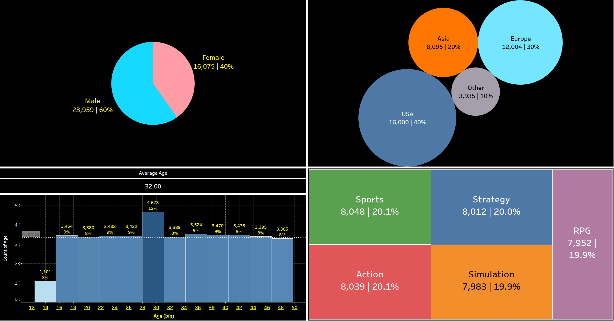
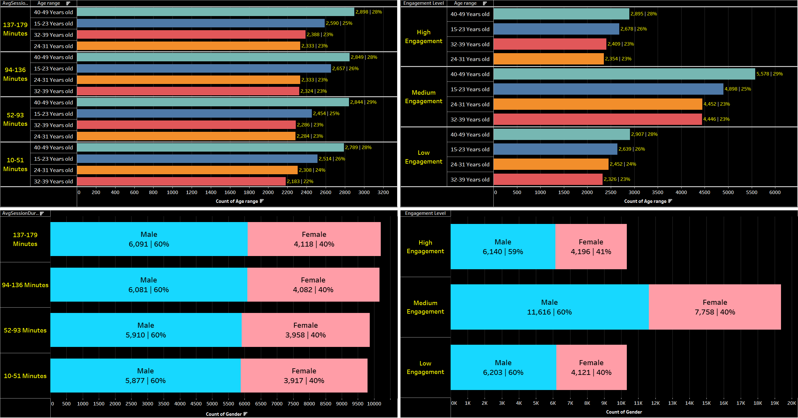
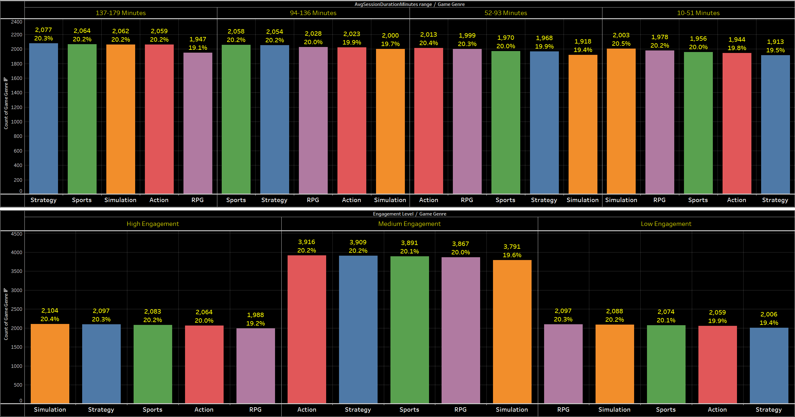
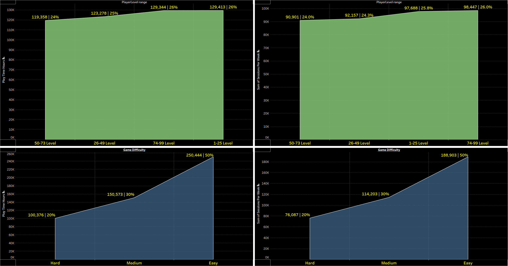
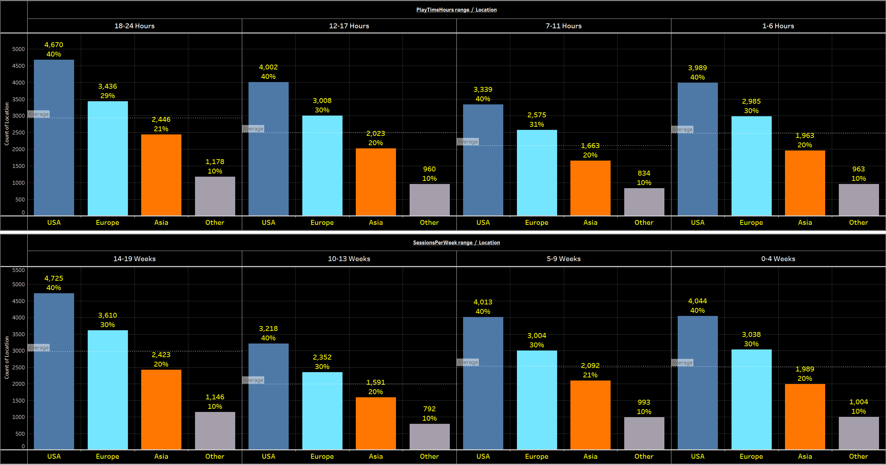

# Leveraging-Gaming-Behavior-Analytics-for-Business-Optimization

This project analyzes the relationship between gaming behavior and factors such as playtime, engagement, and session duration based on game genre, age, gender, difficulty level, player level, and location. The goal is to provide insights into gaming behaviors and their potential impacts across diverse demographics.

## <p align="center">**Table of Contents**</p>  

1. [Summary](#summary)
2. [Installation](#installation)
3. [Data Cleaning](#data-cleaning)
4. [Player Demographic](#player-demographic)
5. [Average Session Duration and Engagement Level by Age and Gender](#age-gender)
6. [Average Session Time vs. Engagement by Genre](#genre)
7. [Player Level and Difficulty Impact on Play Time & Sessions](#level-difficulty)
8. [Location Impact on Play Time & Sessions](#location)
9. [Business Optimization Recommendations](#recommendations)
10. [Acknowledgements](#acknowledgements)

## <p align="center" name="summary">**Summary: The analysis reveals significant insights into video game behaviors among players.**</p>  

### Geographic and Demographic Distribution:

- 40% of the players are from the USA.
- 60% of players are male.
- The most notable age group is 28–31 years old, making up 12% of the player base.

### Genre Insights:

- No specific game genre (Sports, Action, Simulation, Strategy, RPG) stands out in popularity, indicating equal engagement across genres.

### Engagement Analysis:

- Players aged 40–49 demonstrate high engagement levels, playing 137–179 minutes on average. This group comprises 28% of the sample, with 60% being male.

### Player Level and Difficulty Insights:

- Hours played peak at player levels 1–25 and 74–99 (both at 26%).
- Sessions per week are highest at player levels 74–99 (26%).
- Engagement is highest with the "Easy" game difficulty, with 50% of players engaged.

### Weekly Engagement:

- 40% of players who play 18–24 hours per week are from the USA.  
- 40% of players who have weekly sessions lasting 14–19 weeks are also from the USA.  

## <p align="center" name="installation">**Installation**:</p>

This project requires Python 3.11, along with the following Python packages:

- `pandas`
- `numpy`

You can install these packages using pip:

```sh
pip install pandas numpy
```

## <p align="center" name="data-cleaning">**Data Cleaning and Range Mapping Script**:</p>

1. Library Imports:
   - Utilizes pandas for data manipulation and NumPy for numerical operations.

2. File Path and Column Selection:
   - Defines the path to the Parquet file containing the dataset.
   - Specifies columns of interest, focusing on key metrics related to player demographics and behavior.

3. Data Loading:
   - Reads the Parquet file, selecting only the specified columns for efficient memory usage.

4. Data Rounding and Conversion:
   - Rounds up values in certain numerical columns (e.g., age, playtime hours) and converts them to integers for consistency.

5. Range Calculation:
   - Implements a function to calculate quartile ranges for selected columns, storing these ranges in a dictionary.
   - This helps in categorizing continuous data into discrete ranges, which is useful for analysis and visualization.

6. Value to Range Mapping:
   - Defines a function to map individual values to their respective ranges based on the calculated quartiles.

7. Applying Range Mapping:
   - Applies the range mapping to the DataFrame, creating new columns that represent the ranges for the specified numerical columns.

8. Data Export:
   - Saves the cleaned and processed DataFrame to CSV, Parquet, and Excel formats for further analysis and sharing.

9. Debugging and Confirmation:
   - Includes debugging output to verify the correct calculation of ranges.
   - Prints a confirmation message upon successful data cleaning.


## <p align="center" name="player-demographic">**Player demographic**:</p>


Key Demographic Insights:

Most players are from the USA (40% are from the USA).  
Most players are Male (60% are Male).  
Most players are from ages 28 to 31 Years old (12% are from 28 to 31 Years old).  
No game genre is noticeably played more than another (Out of the following: Sports, Action, Simulation, Strategy and RPG).  
  
## <p align="center" name="age-gender">**Average Session Duration and Engagement Level by Age and Gender**:</p>


Key Engagement Insights:

Most players that play from 137 to 179 Minutes, on Average, are from the ages of 40 and 49 years old (28% are 40–49 Years old).  
Most players that play from 137 to 179 Minutes, on Average, are Males (60% are Male).  
Most players that have a High engagement, are from the ages 40–49 Years old (28% are 40–49 Years old).  
Most players who have High engagement, are Males (59% are Male).  

## <p align="center" name="genre">**Average Session Time vs. Engagement by Genre**:</p>


Key Genre Insights:

No significant differences were observed in average session duration or engagement level across the different game genres.  

## <p align="center" name="level-difficulty">**Player Level and Difficulty Impact on Play Time & Sessions**:</p>


Key Gameplay Insights:

Hours played peaked at player levels 1 to 25 and 74 to 99, both at 26%.  
Sessions per week peaked at player levels 74 to 99, at 26%.  
Hours played peaked at the game difficulty level "Easy," at 50%.  
Sessions per week peaked at the game difficulty level "Easy," at 50%.  

## <p align="center" name="location">**Location Impact on Play Time & Sessions**:</p>


Key Location Insights:

Most players who play 18–24 hours per week are from the USA (40%).  
Most players who have weekly sessions lasting 14–19 weeks are from the USA (40%).  

## <p align="center" name="recommendations">**Business Optimization Recommendations:**:</p>

- **Geographic Focus**: Given the high percentage of players from the USA, tailor marketing strategies and game features to this market to maximize engagement and revenue.  

- **Gender and Age-Specific Strategies**: Develop targeted campaigns and content for males aged 40-49, as they represent a highly engaged demographic.  

- **Genre Diversification**: Since no genre dominates, consider promoting a variety of genres to maintain broad appeal.  

- **Level and Difficulty Balancing**: Focus on player retention strategies at levels 1-25 and 74-99, and consider optimizing the "Easy" difficulty to sustain high engagement.  

- **Subscription Models**: Introduce premium subscriptions or additional content for players who are highly engaged weekly, particularly those playing 18–24 hours.  

This project demonstrates the value of data-driven insights for optimizing business strategies in the gaming industry, showcasing your ability to analyze and leverage gaming behavior analytics effectively.  

## <p align="center" name="acknowledgements">**Acknowledgements**:</p>

- Data obtained from RABIE EL KHAROUA: https://www.kaggle.com/datasets/rabieelkharoua/predict-online-gaming-behavior-dataset/data
